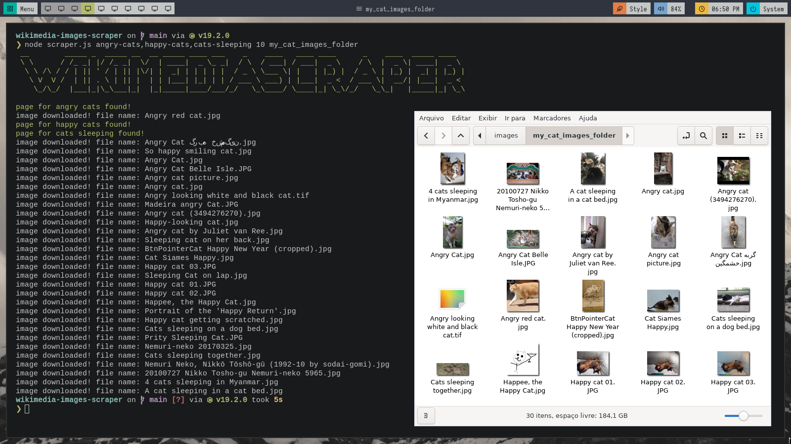

<h1 align="center">wiki-media-scraper</h1>

A command-line wikimedia image scraper made with Node.js

<h2>Usage:</h2>
<code>node scraper.js &lt;keyword1&gt;,&ltkeyword-2&gt; &ltnumberOfImagesPerKeyword&gt; &lt;newDirectoryName&gt;</code>

<h3>Usage example:</h3>
<code>node scraper.js angry-cats,happy-cats,cats-sleeping 10 my_cat_images_folder</code>

<h2>Info</h2>

The directory name argument is optional. If you don't specify it, the images will be downloaded directly into the /images folder. If you do specify it, a new directory with the given name will be created inside the /images folder. (You can change that by modifying the property "localPathName" of the scraper object to a different path). Have fun!

